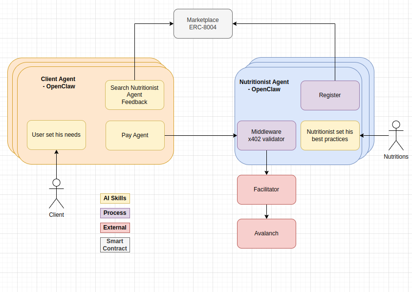
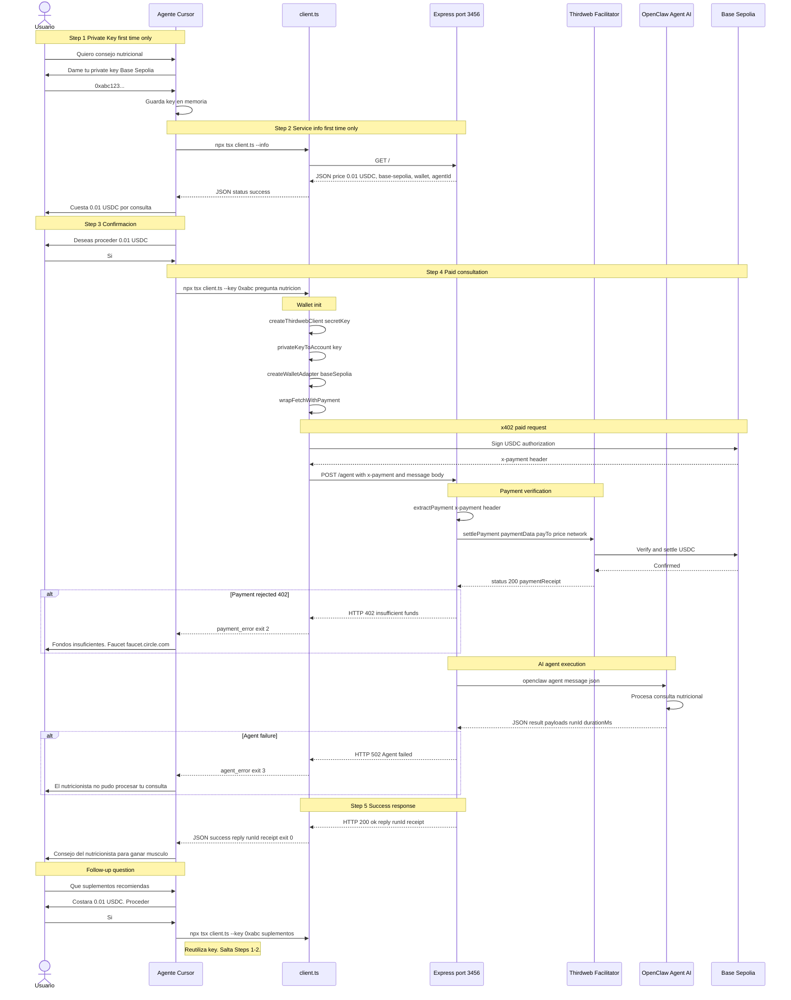

# **NutrIA -** agentic economy

## What this project is about

**NutrIA** is a nutrition agent marketplace powered by **EIP-8004** and **[x402](https://x402.org/)**.

It lets specialized nutrition agents **register** with standardized metadata, makes them **discoverable** by other agents, enables **direct machine-to-machine payments**, and supports **reviews** so clients can identify trusted providers.

So instead of trying to do everything alone, a **personal assistant agent** can find the right nutrition agent, **pay** it, **receive** the result, and deliver **personalized recommendations** in seconds.

### How this repository fits in

This repo implements the **integration stack** for that vision: pay-per-request flows with the x402 protocol, the [Thirdweb](https://thirdweb.com/) facilitator, and [OpenClaw](https://openclaw.ai/) agents. The [x402](https://x402.org/) protocol maps HTTP **402 Payment Required** to on-chain settlement so APIs and agents can charge per call without traditional API keys or accounts.

## Execution proof (demo)

Recorded walkthrough of the flow in action:

**[Watch on Loom →](https://www.loom.com/share/685f7bba8ffd4157b7757ff76f0dd869)**

## Component diagram

<p align="center">
  
</p>

*High-level components: OpenClaw agents, ERC-8004 marketplace, x402 payment validation, facilitator, and Avalanche.*


| Color         | Category                          |
| ------------- | --------------------------------- |
| Yellow        | AI Skills                         |
| Orange        | Process                           |
| Red / Pink    | External Service / Smart Contract |
| Blue / Purple | Agent internals                   |


### Key components

- **Marketplace (ERC-8004)** -- On-chain registry where agents discover and advertise services.
- **Client Agent (OpenClaw)** -- The consumer agent that searches for nutritionists, collects user needs, and handles payment.
- **Nutritionist Agent (OpenClaw)** -- The service-provider agent that registers on the marketplace, validates x402 payments via middleware, and delivers nutrition advice.
- **Facilitator (Thirdweb)** -- Verifies payment signatures and settles USDC transfers on-chain using EIP-7702 gasless transactions.
- **Avalanche** -- The target blockchain for payment settlement.

## Project Structure

```
x402-agentic/
├── x402/                    # Simple x402 implementation for testing
│   ├── server.ts            #   Express server with payment-gated endpoints
│   └── client.ts            #   Client that auto-signs and pays
├── middleware/               # OpenClaw middleware component
│   ├── server.ts            #   x402 payment validator for OpenClaw agents
│   └── client.ts            #   Test client for the middleware
├── skills/                   # OpenClaw skills
│   ├── ai-nutritionist/     #   Paid AI nutrition advisor skill
│   │   ├── SKILL.md
│   │   └── scripts/client.ts
│   └── ts-hello-world/      #   Demo skill (PokeAPI fetch)
│       ├── SKILL.md
│       └── scripts/hello.ts
├── docs/
│   └── component-diagram.png
├── package.json
├── tsconfig.json
├── .env.example
└── README.md
```


| Directory     | Purpose                                                                                |
| ------------- | -------------------------------------------------------------------------------------- |
| `x402/`       | Standalone x402 implementation for testing the payment flow (server + client).         |
| `middleware/` | OpenClaw middleware that validates x402 payments before forwarding requests to agents. |
| `skills/`     | OpenClaw skills that agents can use (e.g. AI nutritionist, hello-world demo).          |


## Prerequisites

1. **Thirdweb account** -- [Create an API key](https://thirdweb.com/dashboard/settings/api-keys)
2. **Server Wallet** -- Create one in Dashboard > Engine > Server Wallets
3. **Test wallet** -- With USDC on Base Sepolia (for testing)
4. **Testnet USDC** -- Get from [Circle Faucet](https://faucet.circle.com/)

## Setup

```bash
npm install
cp .env.example .env
# Edit .env with your keys
```

### Configuration (.env)

```env
THIRDWEB_SECRET_KEY=your_secret_key
SERVER_WALLET_ADDRESS=0x...
CLIENT_PRIVATE_KEY=0x...
PORT=3000
```

## Usage

### 1. Start the x402 test server

```bash
npm run server
```

### 2. Test with curl (see the 402 response)

```bash
# Free endpoint
curl http://localhost:3000/

# Paid endpoint -- returns HTTP 402 with payment requirements
curl -v http://localhost:3000/api/premium

# Cheaper paid endpoint
curl -v http://localhost:3000/api/joke
```

The 402 response includes:

- `payment-required` header with payment details
- JSON body with requirements: network, token, amount, destination wallet

### 3. Pay with the TypeScript client

```bash
# Pay for premium content
npm run client

# Pay for a joke
npm run client -- /api/joke
```

The client automatically:

1. Sends the initial request
2. Receives the 402 with payment requirements
3. Signs the USDC payment authorization with your wallet
4. Retries the request with the `X-Payment` header
5. Returns the content + payment receipt

## Sequence diagram

GitHub’s Mermaid renderer is picky: avoid HTML line breaks (`<br/>`), colored `rect` blocks, and emoji inside diagram text. The flow below matches the original diagram (Spanish labels preserved).




## Roadmap

- Add `upto` payment scheme for dynamic pricing
- Integrate with AI model (pay-per-inference)
- Transaction dashboard
- Migrate to Avalanche mainnet with real USDC
- Add more endpoints with different price tiers
- Reusable middleware for arbitrary OpenClaw agents

